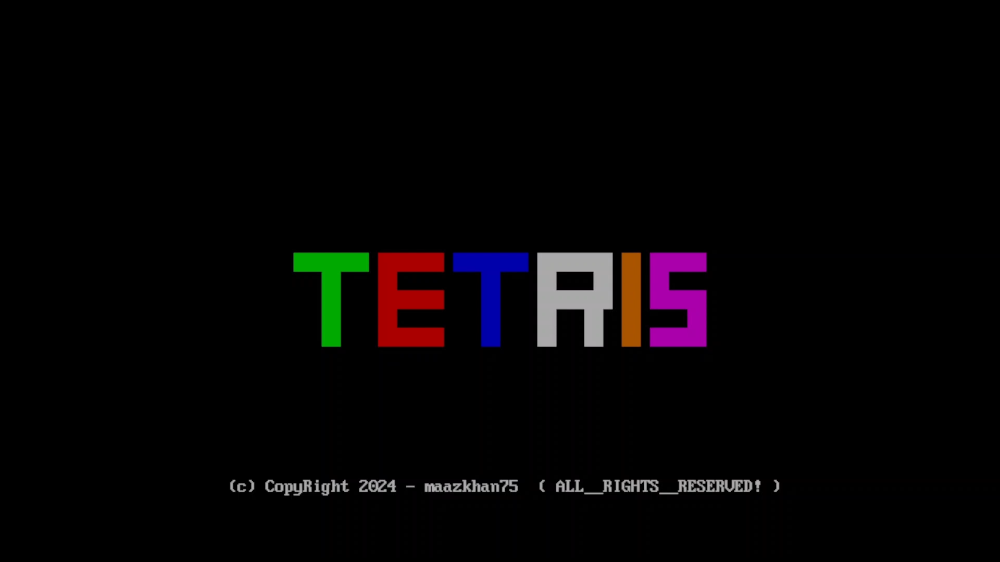
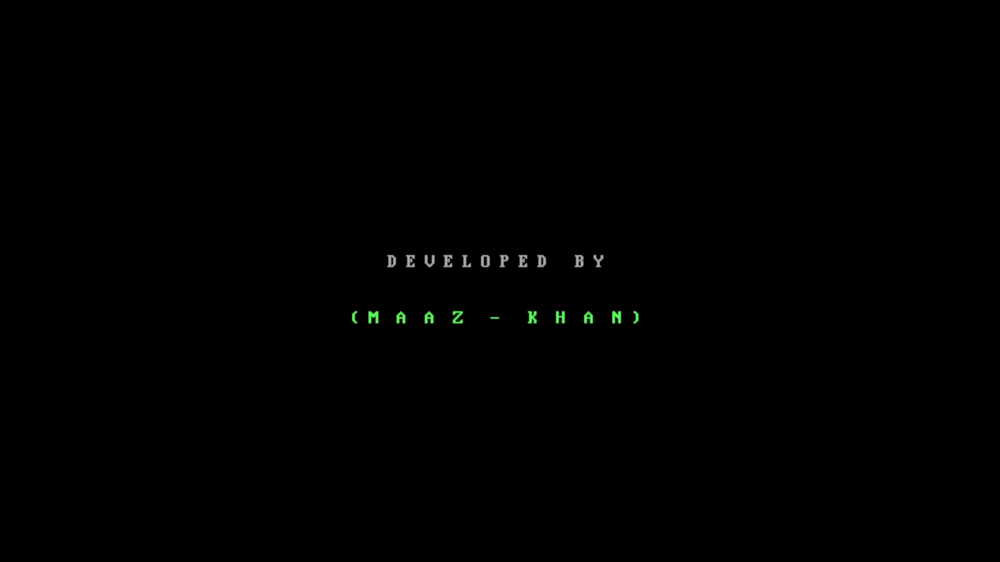
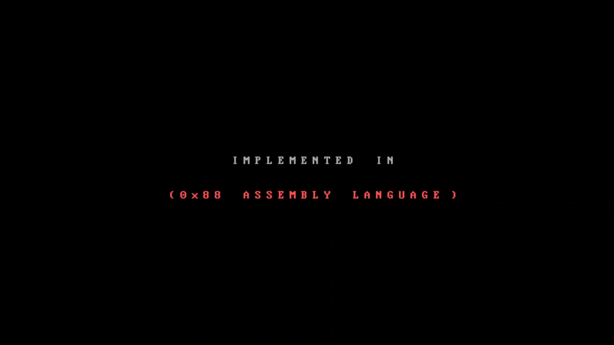
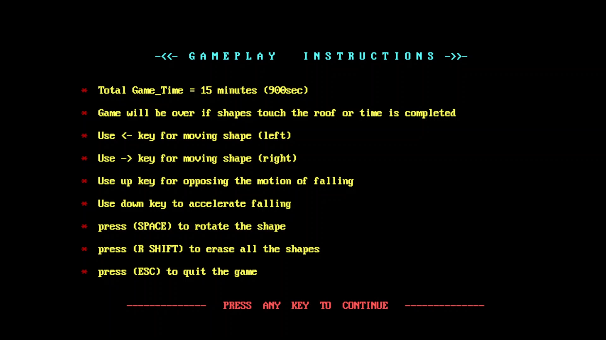
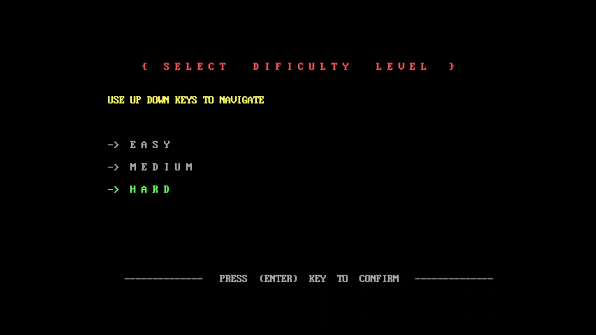
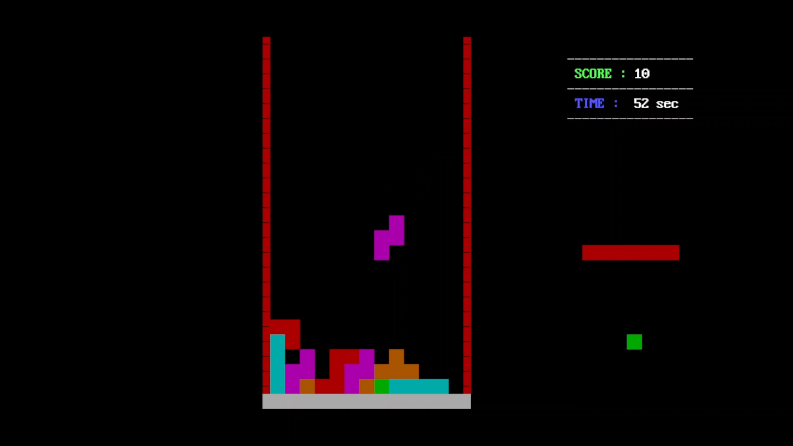
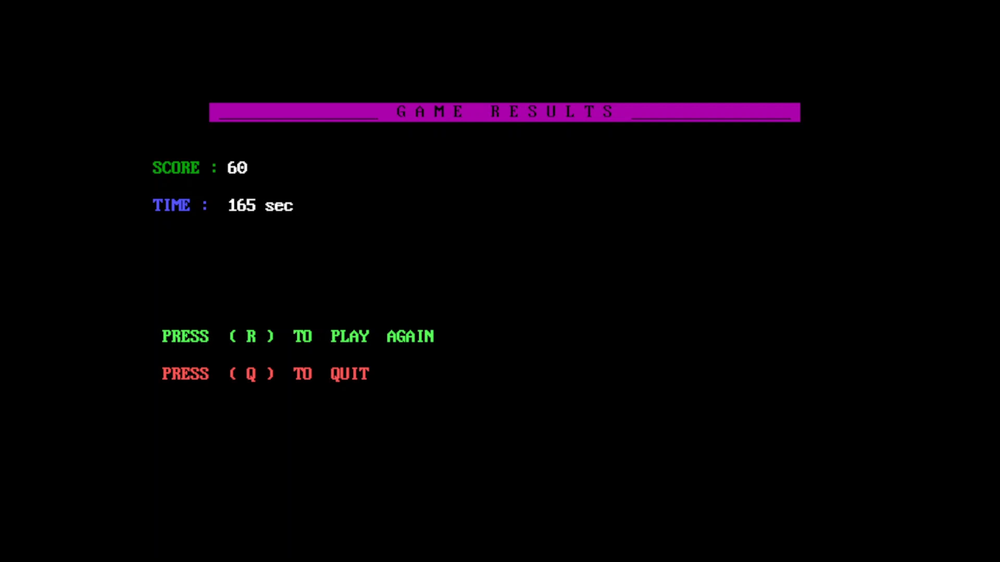

# 🧩 Tetris Game - Assembly 0x88 

## 🌟 Overview


Welcome to the Tetris game developed in Assembly 8088 language! This classic puzzle game comes with a variety of functionalities to provide an engaging gaming experience.

## 🎮 Gameplay Instructions

- **Difficulty Modes**: The game can be played in three different difficulty modes:
		1. Easy
		2. Medium
		3. Hard
- **Game Duration**: Total Game Time = 15 minutes (900 seconds)
- **Game Over Conditions**: The game will be over if the shapes touch the roof or time is completed.
- **Controls**:
	- Use <- key for moving the shape left.
	- Use -> key for moving the shape right.
	- Use ↑ key for opposing the motion of falling.
	- Use ↓ key to accelerate falling.
	- Press SPACE to rotate the shape.
	- Press R SHIFT to erase all the shapes.
	- Press ESC to quit the game.
- **Full Screen Mode**: Press ALT + ENTER for an amazing visual experience of the game.

## 📺 Watch Gameplay
For watching the complete gameplay of the game, check out the YouTube video at the following link:
[Gameplay Video](https://youtu.be/0pRhh-2Oqj4?si=BfQkafR_ErrQr72V)

## 🚀 Startup Guide

### 💻 Mounting Guide for DOSBox
- Open the dos.config file at the estimated path below and paste the commands at the end of the document. Replace the defaultUser with your default username registered on Windows: `C:\Users\defaultUser\Downloads\TetrisGame-0x88\dosboxPortable\Data\settings`
- After mounting, start the game by clicking on the dosbox.exe shortcut and wait for approximately 1 minute for compiling the code (compile time depends on the specs of your machine).
- Once the t.com file is created, you can comment out the line nasm t.asm -o t.com in the config file of dosbox located at `TetrisGame-0x88\dosboxPortable\Data\settings\dosbox.conf` for quicker startup in the future. This can be done by putting a # before the line.
	
### 🛠️ Configuration
Add the following lines at the end of the dos.config file:
```
# Lines in this section will be run at startup.
mount c:  "C:\Users\defaultUser\Downloads\TetrisGame-0x88\"
c:

nasm t.asm -o t.com
t.com
```

## 📜 License

This project is licensed under the `GNU General Public License`.

## 📦 Installation


Clone the repository:

```bash
git clone https://github.com/maazkhan75/Tetris-0x88
```

      
## 📸 Screenshots of Game










