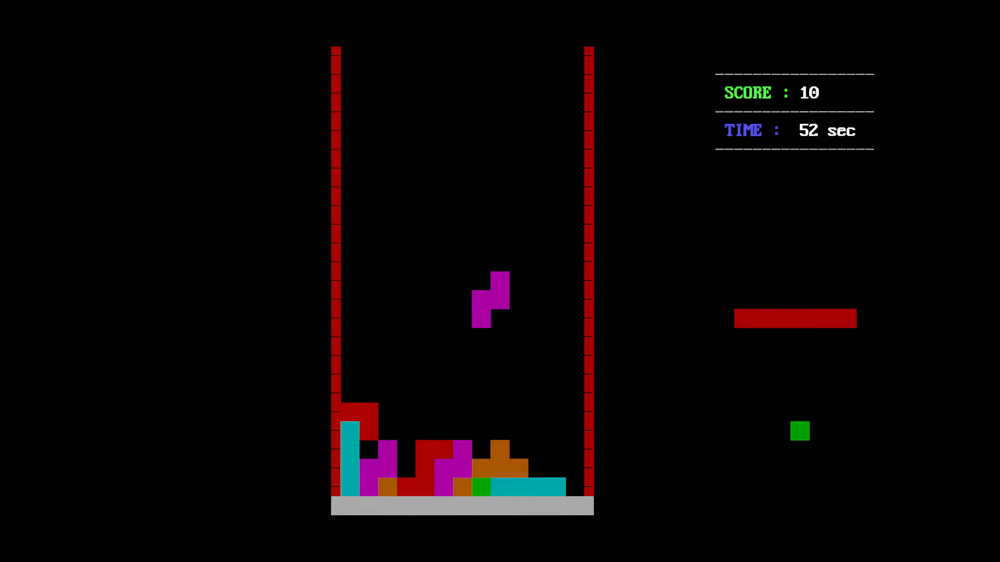

# 🧩 Tetris Game - Assembly 0x88 


## 🌟 Overview


Welcome to the Tetris game developed in Assembly 8088 language! This classic puzzle game comes with a variety of functionalities to provide an engaging gaming experience. Explore the code and experience the nostalgic fun of Tetris! ⏳🕹️

## 🎮 Gameplay Instructions

- **Difficulty Modes**: The game can be played in three different difficulty modes:
	- `Easy`
	- `Medium`
	- `Hard`
- **Game Duration**: Total Game Time = 15 minutes (900 seconds) ⏳
- **Game Over Conditions**: The game will be over if the shapes touch the roof or time is completed. 🚫
- **Controls**:
	- Use ⬅️ key for moving the shape left.
	- Use ➡️ key for moving the shape right.
	- Use ⬆️ key for opposing the motion of falling.
	- Use ⬇️ key to accelerate falling.
	- Press `SPACE` to rotate the shape.
	- Press `R SHIFT` to erase all the shapes. (kind of a cheat code in game ⚡)
	- Press `ESC` to quit the game. 🚪
- **Full Screen Mode**: Press `ALT + ENTER` for an amazing visual experience of the game. 🖥️

## 📺 Watch Gameplay
For watching the complete gameplay of the game, check out the YouTube video at the following link:
[Gameplay Video](https://youtu.be/0pRhh-2Oqj4?si=BfQkafR_ErrQr72V) 🎥

## 🚀 Startup Guide

### 💻 Mounting Guide for DOSBox
- Open the `dosbox.conf` file at the estimated path: `C:\Users\defaultUser\Downloads\TetrisGame-0x88\dosboxPortable\Data\settings\dosbox.conf`
  
- Add the following lines at the end of the `dos.config` file:
```
# Lines in this section will be run at startup.
mount c:  "C:\Users\defaultUser\Downloads\TetrisGame-0x88\"
c:

nasm t.asm -o t.com
t.com
```

- After mounting, start the game by clicking on the `dosbox.exe shortcut` and wait for approximately 1 minute for compiling the code (compile time depends on the specs of your machine).
  
- Once the t.com file is created, you can comment out the line `nasm t.asm -o t.com` in the config file of dosbox located at `TetrisGame-0x88\dosboxPortable\Data\settings\dosbox.conf` for quicker startup in the future. This can be done by putting a # before the line.
	
### 🛠️ Configuration


## 📜 License

This project is licensed under the `GNU General Public License`.

## 📦 Clone repository

```bash
git clone https://github.com/maazkhan75/Tetris-0x88
```

      
## 📸 Screenshots of Game





